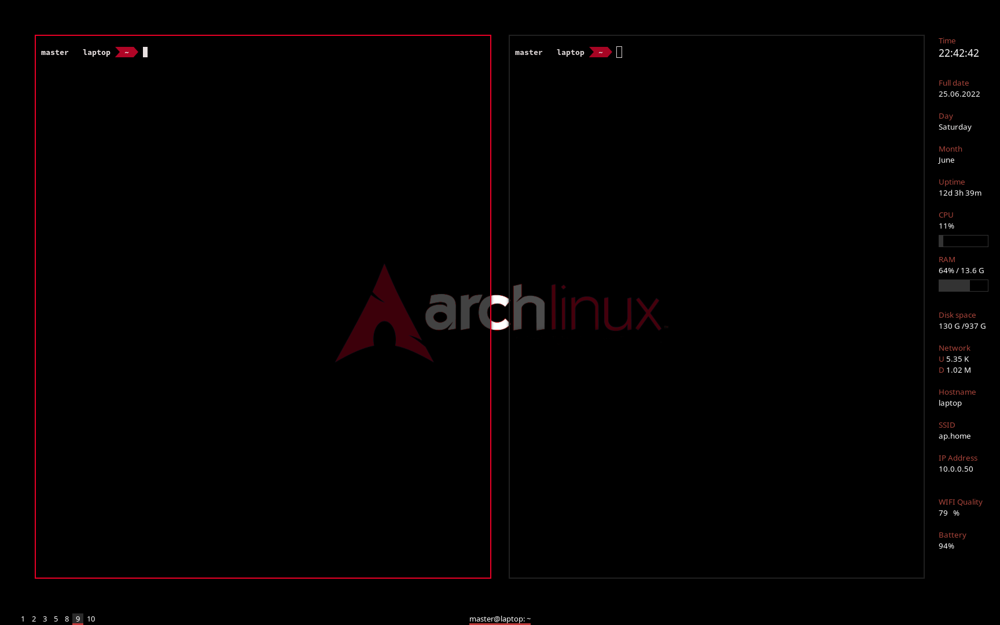
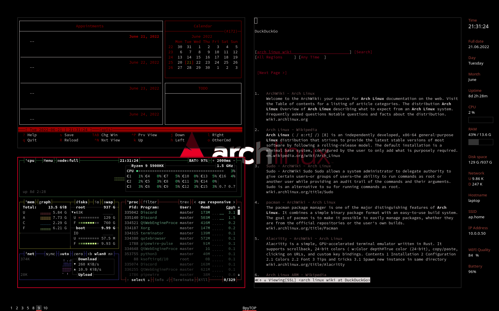
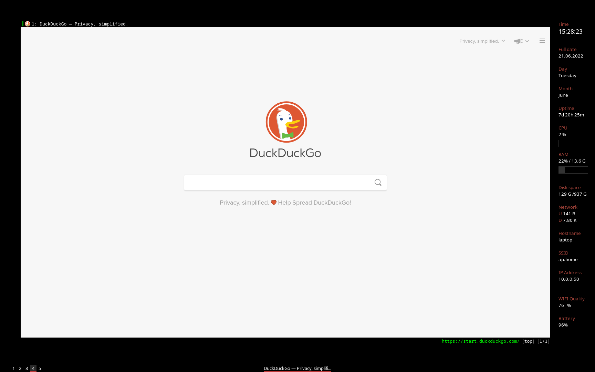

# i3wm-dark-red
My i3 window manager setup | black and red rice 
   

 - - - -
Some packages i use:
* terminator
* [qutebrowser](https://www.qutebrowser.org "qutebrowser")
* [betterlockscreen](https://github.com/betterlockscreen/betterlockscreen "betterlockscreen")
* conky
* [pywal](https://github.com/dylanaraps/pywal "pywal")
* [polybar](https://github.com/polybar/polybar "polybar")
* feh
* picom
* dunst
* [rofi](https://github.com/davatorium/rofi "ROFI")
 - - - -
